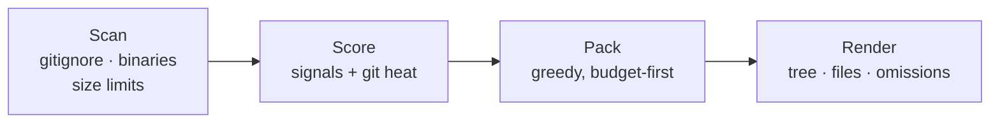

<div align="center">


**Pack your repository into an LLM-ready prompt under a strict token budget.**

Highest-value files first. Omissions reported. Nothing wasted.

[](https://pypi.org/project/budgetpack/)
[](https://pypi.org/project/budgetpack/)
[](https://github.com/Zhuayu16/budgetpack/actions)
[](https://github.com/astral-sh/ruff)
[](LICENSE)
[](https://github.com/Zhuayu16/budgetpack/stargazers)

English | [简体中文](README.zh-CN.md)

</div>

---

Dumping a whole codebase into Claude, ChatGPT or Cursor wastes context on
lock files, generated code and tests - or worse, gets silently truncated at
the far end. **budgetpack asks how much room you have, then spends it like a
budget:** README and entry points first, low-value files last, and a report
that shows exactly what made the cut.

```terminal
$ budgetpack pack . --budget 6000
Packed 8 files (5,904 / 6,000 tokens) -> budgetpack-output.md
11 files omitted - see the report's 'Omitted files' table.
```

Inside `budgetpack-output.md`:

```text
## Repository tree

● packed · ◐ truncated to fit budget · ○ omitted

├── src/budgetpack/
│   ├── cli.py  ● 1,290        ← highest-traffic file, packed first
│   ├── gitignore.py  ● 1,114
│   ├── packer.py  ● 729
│   ├── scanner.py  ○ 1,410    ← didn't fit; reported, never silently dropped
│   └── ...
├── pyproject.toml  ● 414
└── tests/  ...  ○ omitted     ← tests rank low on purpose

## Omitted files
| File | Tokens | Reason |
|---|---:|---|
| `src/budgetpack/scanner.py` | 1.4k | needs 1,410 tokens, only 96 left in budget |
```

Paste the file into any LLM chat, or point your agent at it.

## ✨ Features

- **💸 Budget-first packing** - give it 10k or 200k tokens; it fills the budget
  to ~100% utilization with the most useful code, never over.
- **🧠 Multi-signal prioritization** - README and entry points rank highest,
  git-change heat ("hot files") gets a boost, tests and deep nesting rank
  lower. Every file's score is explainable.
- **📋 Nothing disappears silently** - files that don't fit are listed in an
  *Omitted files* table with their token cost and the reason.
- **✂️ Smart truncation** - when one big file is the only thing missing,
  budgetpack truncates it to exactly fill the leftover budget and marks it.
- **🪶 Zero dependencies** - pure Python standard library, one small
  executable. Optional `budgetpack[tokens]` enables exact tiktoken counting.
- **🤝 Respects your repo** - parses `.gitignore` (including `!negation` and
  `**`), skips binaries, lock files, `node_modules` and friends by default.
- **🔍 Repo introspection** - `budgetpack stats` shows which files eat your
  context before you pack anything.

## 🚀 Quick start

```bash
pipx install budgetpack      # or: pip install budgetpack
```

```bash
# pack the current repo with the default 100k-token budget
budgetpack pack .

# squeeze a big monorepo into a 32k context window
budgetpack pack ~/work/monorepo --budget 32000 -o context.md

# only the source, no tests, straight to the clipboard pipeline
budgetpack pack . --include "src/**" --exclude "tests/" --stdout | clip
```

Then: open `budgetpack-output.md`, paste it into your LLM of choice, done.

New to a codebase? Start with the breakdown:

```terminal
$ budgetpack stats . --top 5
  TOKENS   SHARE   SCORE  REASON / FILE
------------------------------------------------------------------------
    1,443   11.1%     230
                           src/budgetpack/render.py
    1,410   10.8%     230
                           src/budgetpack/scanner.py
    ...
```

## 🧠 How it works



Scoring signals (higher wins; full rules in
[`prioritize.py`](src/budgetpack/prioritize.py)):

| Signal | Effect |
|---|---|
| `README*` | +1000 - the project overview comes first |
| Entry points (`main.py`, `cli.py`, `index.js`, `main.go`, ...) | +500 |
| Manifests (`pyproject.toml`, `package.json`, `go.mod`, `Dockerfile`, ...) | +400 |
| Source files in `src/`, `lib/`, `app/`, `pkg/` | +150 to +270 |
| Git-change heat (commits touching the file) | up to +200 |
| Documentation (`.md`) | +60 |
| Directory nesting depth | −20 per level |
| Test files | −250 |
| Very large (>20k tokens, likely generated) | −100 |

Token counting uses a chars÷4 heuristic by default; install the extra for
exact counts: `pip install "budgetpack[tokens]"`.

## 📖 CLI reference

### `budgetpack pack [PATH]`

| Option | Description |
|---|---|
| `-b, --budget N` | token budget for file contents (default: 100,000) |
| `-o, --output FILE` | output file (default: `./budgetpack-output.md`) |
| `--stdout` | print the pack instead of writing a file |
| `-i, --include GLOB` | only files matching the glob (repeatable) |
| `-e, --exclude GLOB` | skip matching files (repeatable) |
| `--no-gitignore` | ignore `.gitignore` files |
| `--no-default-excludes` | also scan `node_modules`, lock files, etc. |
| `--max-file-size MB` | skip single files above this size (default: 1 MB) |

### `budgetpack stats [PATH]`

| Option | Description |
|---|---|
| `--top N` | rows to show (default: 25) |
| `--why` | show the top scoring reason per file |

A default invocation works too: `budgetpack .` means `budgetpack pack .`.

## 🆚 How it compares

| | budgetpack | repomix | gitingest |
|---|---|---|---|
| Token budget enforcement | ✅ core feature | ❌ | ❌ |
| Value-based priority ranking | ✅ | ❌ (tree order) | ❌ (tree order) |
| Omission report | ✅ | ❌ | ❌ |
| Runtime dependencies | none | Node.js | Python |
| Web UI / remote repos | planned (see roadmap) | ✅ | ✅ |

*As of v0.1.0, September 2026 - check their docs for the latest.*
[repomix](https://github.com/yamadashy/repomix) and
[gitingest](https://github.com/coderamp-labs/gitingest) are excellent
pack-everything tools; budgetpack is the budget-first take on the same job.

## ❓ FAQ

**Why not just concatenate everything?**
Context is money and attention. Lock files and generated code can eat half a
context window before your real source code appears. budgetpack spends the
window on what the model actually needs.

**How accurate are the token counts?**
The default heuristic (chars÷4) is within ~10% for typical code. Install
`budgetpack[tokens]` for exact cl100k_base counts. The budget is enforced
against whichever backend is active.

**Can I re-include something that was excluded?**
Yes - `--no-default-excludes` drops the built-in hygiene rules, and
`-e`/`-i` globs are fully under your control.

**Where should the output go?**
`budgetpack-output.md` lands in your current directory. Add it to your
`.gitignore` (the repo's own `.gitignore` does), or use `--stdout`.

**Does it work on Windows?**
Yes - it's pure standard-library Python and tested on Linux, macOS and
Windows in CI.

## 🗺️ Roadmap

- [ ] `--git-diff` mode: pack only files changed since a ref (perfect for review prompts)
- [ ] JSON / XML output formats
- [ ] `budgetpack.toml` project config
- [ ] Remote repo support (`budgetpack pack github://owner/repo`)
- [ ] Tree-sitter symbol extraction for smarter ranking

## 🤝 Contributing

Issues and PRs are welcome - see [CONTRIBUTING.md](CONTRIBUTING.md). The
codebase is ~1,000 lines, stdlib-only, fully tested; it's meant to be read.

## ⭐ Star history

[](https://star-history.com/#Zhuayu16/budgetpack&Date)

## 📄 License

[MIT](LICENSE) © budgetpack contributors
