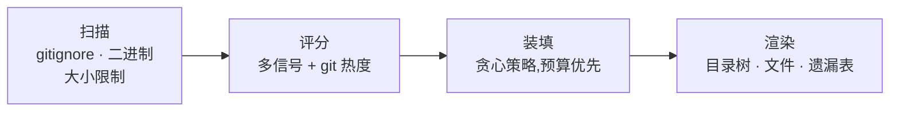

<div align="center">


**把整个仓库按 token 预算智能打包成一份 LLM 提示词。**

高价值文件优先装填。遗漏如实报告。不浪费一个 token。

[](https://pypi.org/project/budgetpack/)
[](https://pypi.org/project/budgetpack/)
[](https://github.com/Zhuayu16/budgetpack/actions)
[](https://github.com/astral-sh/ruff)
[](LICENSE)
[](https://github.com/Zhuayu16/budgetpack/stargazers)

[English](README.md) | 简体中文

</div>

---

把整个代码库一股脑塞给 Claude、ChatGPT 或 Cursor,lock 文件、生成代码和
测试会白白吃掉上下文 —— 甚至在看不见的地方被静默截断。**budgetpack 先问你
有多少预算,再像花钱一样把它花在刀刃上**:README 和入口文件最先装填,
低价值文件垫底,并生成一份报告,明确告诉你哪些文件被装进来了、哪些没有。

```terminal
$ budgetpack pack . --budget 6000
Packed 8 files (5,904 / 6,000 tokens) -> budgetpack-output.md
11 files omitted - see the report's 'Omitted files' table.
```

`budgetpack-output.md` 里面长这样:

```text
## Repository tree

● 已打包 · ◐ 因预算截断 · ○ 已省略

├── src/budgetpack/
│   ├── cli.py  ● 1,290        ← 最高优先级,最先装填
│   ├── gitignore.py  ● 1,114
│   ├── packer.py  ● 729
│   ├── scanner.py  ○ 1,410    ← 装不下了;如实报告,绝不静默丢弃
│   └── ...
├── pyproject.toml  ● 414
└── tests/  ...  ○ 已省略      ← 测试文件优先级本来就低

## Omitted files
| File | Tokens | Reason |
|---|---:|---|
| `src/budgetpack/scanner.py` | 1.4k | needs 1,410 tokens, only 96 left in budget |
```

把这份文件粘贴进任意 LLM 对话框,或直接让 Agent 读它。

## ✨ 特性

- **💸 预算优先的打包** —— 给它 1 万或 20 万 token,它以接近 100% 的
  利用率装满最有用的代码,绝不超过预算。
- **🧠 多信号优先级评分** —— README 和入口文件权重最高,"git 改动热度"
  高的文件加分,测试和深层嵌套降权。每个文件的分数都可解释。
- **📋 没有任何文件会静默消失** —— 装不下的文件全部列在 *Omitted files*
  表里,附上 token 开销和原因。
- **✂️ 智能截断** —— 当只差一个大文件装不下时,budgetpack 会把它截断到
  恰好填满剩余预算,并在报告中明确标注。
- **🪶 零依赖** —— 纯 Python 标准库,单个小体积可执行文件。可选安装
  `budgetpack[tokens]` 启用 tiktoken 精确计数。
- **🤝 尊重你的仓库** —— 解析 `.gitignore`(含 `!` 取反与 `**`),默认
  跳过二进制、lock 文件、`node_modules` 等。
- **🔍 仓库体检** —— `budgetpack stats` 在打包之前先告诉你哪些文件在
  吞噬你的上下文。

## 🚀 快速开始

```bash
pipx install budgetpack      # 或:pip install budgetpack
```

```bash
# 以默认 10 万 token 预算打包当前仓库
budgetpack pack .

# 把大型 monorepo 压进 32k 上下文窗口
budgetpack pack ~/work/monorepo --budget 32000 -o context.md

# 只要源码、不要测试,直接接管道
budgetpack pack . --include "src/**" --exclude "tests/" --stdout
```

然后:打开 `budgetpack-output.md`,粘贴给你喜欢的 LLM,完事。

初来乍到看不懂代码库?先看分布:

```terminal
$ budgetpack stats . --top 5
  TOKENS   SHARE   SCORE  REASON / FILE
------------------------------------------------------------------------
    1,443   11.1%     230
                           src/budgetpack/render.py
    ...
```

## 🧠 工作原理



评分信号(分高者优先;完整规则见
[`prioritize.py`](src/budgetpack/prioritize.py)):

| 信号 | 影响 |
|---|---|
| `README*` | +1000 —— 项目概览永远第一 |
| 入口文件(`main.py`、`cli.py`、`index.js`、`main.go`……) | +500 |
| 清单文件(`pyproject.toml`、`package.json`、`go.mod`、`Dockerfile`……) | +400 |
| `src/`、`lib/`、`app/`、`pkg/` 下的源码 | +150 ~ +270 |
| git 改动热度(提交次数) | 最高 +200 |
| 文档(`.md`) | +60 |
| 目录嵌套深度 | 每层 −20 |
| 测试文件 | −250 |
| 超大文件(>2 万 token,疑似生成物) | −100 |

token 计数默认用"字符数 ÷ 4"启发式;装上扩展即可精确计数:
`pip install "budgetpack[tokens]"`。

## 📖 CLI 参考

### `budgetpack pack [PATH]`

| 选项 | 说明 |
|---|---|
| `-b, --budget N` | 文件内容的 token 预算(默认 100,000) |
| `-o, --output FILE` | 输出文件(默认 `./budgetpack-output.md`) |
| `--stdout` | 打印到标准输出而不写文件 |
| `-i, --include GLOB` | 只保留匹配的文件(可重复) |
| `-e, --exclude GLOB` | 跳过匹配的文件(可重复) |
| `--no-gitignore` | 忽略 `.gitignore` |
| `--no-default-excludes` | 连 `node_modules`、lock 文件也扫描 |
| `--max-file-size MB` | 跳过超过该大小的单文件(默认 1 MB) |

### `budgetpack stats [PATH]`

| 选项 | 说明 |
|---|---|
| `--top N` | 显示行数(默认 25) |
| `--why` | 显示每个文件的评分原因 |

直接 `budgetpack .` 也行,等价于 `budgetpack pack .`。

## 🆚 同类对比

| | budgetpack | repomix | gitingest |
|---|---|---|---|
| token 预算控制 | ✅ 核心特性 | ❌ | ❌ |
| 按价值排优先级 | ✅ | ❌(目录树顺序) | ❌(目录树顺序) |
| 遗漏清单 | ✅ | ❌ | ❌ |
| 运行时依赖 | 无 | Node.js | Python |
| Web 界面 / 远程仓库 | 规划中(见 Roadmap) | ✅ | ✅ |

*截至 2026 年 9 月 v0.1.0,最新情况请看它们的文档。*
[repomix](https://github.com/yamadashy/repomix) 与
[gitingest](https://github.com/coderamp-labs/gitingest) 是优秀的"全量打包"
工具;budgetpack 是同一件事的"预算优先"做法。

## ❓ 常见问题

**为什么不直接全部拼接?**
上下文就是钱和注意力。lock 文件和生成代码可能在真正的源码出现之前就吃掉
半个上下文窗口。budgetpack 把窗口花在模型真正需要的东西上。

**token 计数准确吗?**
默认启发式(字符 ÷ 4)对典型代码误差约 10% 以内。安装
`budgetpack[tokens]` 可获得精确的 cl100k_base 计数。预算按当前后端严格执行。

**被排除的东西还能找回来吗?**
可以 —— `--no-default-excludes` 关闭内置规则,`-e`/`-i` 通配完全由你控制。

**输出应该放在哪?**
`budgetpack-output.md` 会写到你当前目录。建议加进 `.gitignore`(本仓库自己
就是这么做的),或者直接用 `--stdout`。

**支持 Windows 吗?**
支持 —— 纯标准库实现,CI 覆盖 Linux、macOS、Windows。

## 🗺️ Roadmap

- [ ] `--git-diff` 模式:只打包某个 ref 以来的改动(做评审提示词绝佳)
- [ ] JSON / XML 输出格式
- [ ] `budgetpack.toml` 项目配置文件
- [ ] 远程仓库支持(`budgetpack pack github://owner/repo`)
- [ ] 基于 tree-sitter 的符号级智能排序

## 🤝 参与贡献

欢迎 Issue 和 PR,见 [CONTRIBUTING.md](CONTRIBUTING.md)。全部代码约一千行、
纯标准库、测试完备 —— 就是要让人读得懂。

## ⭐ Star 历史

[](https://star-history.com/#Zhuayu16/budgetpack&Date)

## 📄 许可证

[MIT](LICENSE) © budgetpack contributors
