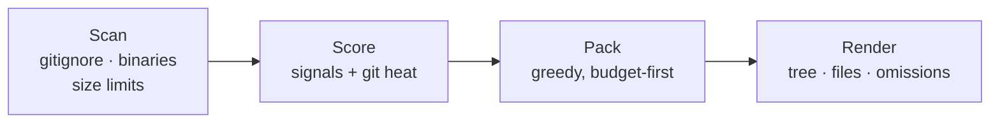

# Codebase Pack

Generated by [budgetpack](https://github.com/Zhuayu16/budgetpack) - packed *budgetpack* for LLM consumption.

- **Source:** `C:/Users/Zhua/.zcode/workspace/default/budgetpack`
- **Generated:** 2026-09-13 19:25
- **Tokenizer:** heuristic (chars/4)
- **Budget:** 6,000 tokens - packed 5,910 (98.5%)
- **Files:** 7 packed, 18 omitted (25 found)

## Repository tree

● packed · ◐ truncated to fit budget · ○ omitted

```text
├── .github/
│   └── workflows/
│       └── ci.yml  ○ 153
├── assets/
│   └── logo.svg  ○ 208
├── src/
│   └── budgetpack/
│       ├── __init__.py  ● 28
│       ├── __main__.py  ● 27
│       ├── cli.py  ● 1,318
│       ├── gitignore.py  ○ 1,107
│       ├── packer.py  ● 729
│       ├── prioritize.py  ○ 859
│       ├── render.py  ○ 1,440
│       ├── scanner.py  ○ 1,405
│       └── tokens.py  ○ 440
├── tests/
│   ├── helpers.py  ○ 354
│   ├── test_cli.py  ○ 603
│   ├── test_gitignore.py  ○ 927
│   ├── test_packer.py  ○ 915
│   ├── test_prioritize.py  ○ 619
│   ├── test_render.py  ○ 694
│   ├── test_scanner.py  ○ 654
│   └── test_tokens.py  ○ 250
├── CHANGELOG.md  ○ 392
├── CONTRIBUTING.md  ○ 455
├── LICENSE  ○ 270
├── README.md  ● 2,022
├── README.zh-CN.md  ● 1,381
└── pyproject.toml  ● 405
```

## File contents

### README.md

*2,022 tokens*

````markdown
<div align="center">


**Pack your repository into an LLM-ready prompt under a strict token budget.**

Highest-value files first. Omissions reported. Nothing wasted.

[](https://pypi.org/project/budgetpack/)
[](https://pypi.org/project/budgetpack/)
[](https://github.com/Zhuayu16/budgetpack/actions)
[](https://github.com/astral-sh/ruff)
[](LICENSE)
[](https://github.com/Zhuayu16/budgetpack/stargazers)

English | [简体中文](README.zh-CN.md)

</div>

---

Dumping a whole codebase into Claude, ChatGPT or Cursor wastes context on
lock files, generated code and tests - or worse, gets silently truncated at
the far end. **budgetpack asks how much room you have, then spends it like a
budget:** README and entry points first, low-value files last, and a report
that shows exactly what made the cut.

```terminal
$ budgetpack pack . --budget 6000
Packed 8 files (5,904 / 6,000 tokens) -> budgetpack-output.md
11 files omitted - see the report's 'Omitted files' table.
```

Inside `budgetpack-output.md`:

```text
## Repository tree

● packed · ◐ truncated to fit budget · ○ omitted

├── src/budgetpack/
│   ├── cli.py  ● 1,290        ← highest-traffic file, packed first
│   ├── gitignore.py  ● 1,114
│   ├── packer.py  ● 729
│   ├── scanner.py  ○ 1,410    ← didn't fit; reported, never silently dropped
│   └── ...
├── pyproject.toml  ● 414
└── tests/  ...  ○ omitted     ← tests rank low on purpose

## Omitted files
| File | Tokens | Reason |
|---|---:|---|
| `src/budgetpack/scanner.py` | 1.4k | needs 1,410 tokens, only 96 left in budget |
```

Paste the file into any LLM chat, or point your agent at it.

## ✨ Features

- **💸 Budget-first packing** - give it 10k or 200k tokens; it fills the budget
  to ~100% utilization with the most useful code, never over.
- **🧠 Multi-signal prioritization** - README and entry points rank highest,
  git-change heat ("hot files") gets a boost, tests and deep nesting rank
  lower. Every file's score is explainable.
- **📋 Nothing disappears silently** - files that don't fit are listed in an
  *Omitted files* table with their token cost and the reason.
- **✂️ Smart truncation** - when one big file is the only thing missing,
  budgetpack truncates it to exactly fill the leftover budget and marks it.
- **🪶 Zero dependencies** - pure Python standard library, one small
  executable. Optional `budgetpack[tokens]` enables exact tiktoken counting.
- **🤝 Respects your repo** - parses `.gitignore` (including `!negation` and
  `**`), skips binaries, lock files, `node_modules` and friends by default.
- **🔍 Repo introspection** - `budgetpack stats` shows which files eat your
  context before you pack anything.

## 🚀 Quick start

```bash
pipx install budgetpack      # or: pip install budgetpack
```

```bash
# pack the current repo with the default 100k-token budget
budgetpack pack .

# squeeze a big monorepo into a 32k context window
budgetpack pack ~/work/monorepo --budget 32000 -o context.md

# only the source, no tests, straight to the clipboard pipeline
budgetpack pack . --include "src/**" --exclude "tests/" --stdout | clip
```

Then: open `budgetpack-output.md`, paste it into your LLM of choice, done.

New to a codebase? Start with the breakdown:

```terminal
$ budgetpack stats . --top 5
  TOKENS   SHARE   SCORE  REASON / FILE
------------------------------------------------------------------------
    1,443   11.1%     230
                           src/budgetpack/render.py
    1,410   10.8%     230
                           src/budgetpack/scanner.py
    ...
```

## 🧠 How it works



Scoring signals (higher wins; full rules in
[`prioritize.py`](src/budgetpack/prioritize.py)):

| Signal | Effect |
|---|---|
| `README*` | +1000 - the project overview comes first |
| Entry points (`main.py`, `cli.py`, `index.js`, `main.go`, ...) | +500 |
| Manifests (`pyproject.toml`, `package.json`, `go.mod`, `Dockerfile`, ...) | +400 |
| Source files in `src/`, `lib/`, `app/`, `pkg/` | +150 to +270 |
| Git-change heat (commits touching the file) | up to +200 |
| Documentation (`.md`) | +60 |
| Directory nesting depth | −20 per level |
| Test files | −250 |
| Very large (>20k tokens, likely generated) | −100 |

Token counting uses a chars÷4 heuristic by default; install the extra for
exact counts: `pip install "budgetpack[tokens]"`.

## 📖 CLI reference

### `budgetpack pack [PATH]`

| Option | Description |
|---|---|
| `-b, --budget N` | token budget for file contents (default: 100,000) |
| `-o, --output FILE` | output file (default: `./budgetpack-output.md`) |
| `--stdout` | print the pack instead of writing a file |
| `-i, --include GLOB` | only files matching the glob (repeatable) |
| `-e, --exclude GLOB` | skip matching files (repeatable) |
| `--no-gitignore` | ignore `.gitignore` files |
| `--no-default-excludes` | also scan `node_modules`, lock files, etc. |
| `--max-file-size MB` | skip single files above this size (default: 1 MB) |

### `budgetpack stats [PATH]`

| Option | Description |
|---|---|
| `--top N` | rows to show (default: 25) |
| `--why` | show the top scoring reason per file |

A default invocation works too: `budgetpack .` means `budgetpack pack .`.

## 🆚 How it compares

| | budgetpack | repomix | gitingest |
|---|---|---|---|
| Token budget enforcement | ✅ core feature | ❌ | ❌ |
| Value-based priority ranking | ✅ | ❌ (tree order) | ❌ (tree order) |
| Omission report | ✅ | ❌ | ❌ |
| Runtime dependencies | none | Node.js | Python |
| Web UI / remote repos | planned (see roadmap) | ✅ | ✅ |

*As of v0.1.0, September 2026 - check their docs for the latest.*
[repomix](https://github.com/yamadashy/repomix) and
[gitingest](https://github.com/coderamp-labs/gitingest) are excellent
pack-everything tools; budgetpack is the budget-first take on the same job.

## ❓ FAQ

**Why not just concatenate everything?**
Context is money and attention. Lock files and generated code can eat half a
context window before your real source code appears. budgetpack spends the
window on what the model actually needs.

**How accurate are the token counts?**
The default heuristic (chars÷4) is within ~10% for typical code. Install
`budgetpack[tokens]` for exact cl100k_base counts. The budget is enforced
against whichever backend is active.

**Can I re-include something that was excluded?**
Yes - `--no-default-excludes` drops the built-in hygiene rules, and
`-e`/`-i` globs are fully under your control.

**Where should the output go?**
`budgetpack-output.md` lands in your current directory. Add it to your
`.gitignore` (the repo's own `.gitignore` does), or use `--stdout`.

**Does it work on Windows?**
Yes - it's pure standard-library Python and tested on Linux, macOS and
Windows in CI.

## 🗺️ Roadmap

- [ ] `--git-diff` mode: pack only files changed since a ref (perfect for review prompts)
- [ ] JSON / XML output formats
- [ ] `budgetpack.toml` project config
- [ ] Remote repo support (`budgetpack pack github://owner/repo`)
- [ ] Tree-sitter symbol extraction for smarter ranking

## 🤝 Contributing

Issues and PRs are welcome - see [CONTRIBUTING.md](CONTRIBUTING.md). The
codebase is ~1,000 lines, stdlib-only, fully tested; it's meant to be read.

## ⭐ Star history

[](https://star-history.com/#Zhuayu16/budgetpack&Date)

## 📄 License

[MIT](LICENSE) © budgetpack contributors
````

### README.zh-CN.md

*1,381 tokens*

````markdown
<div align="center">


**把整个仓库按 token 预算智能打包成一份 LLM 提示词。**

高价值文件优先装填。遗漏如实报告。不浪费一个 token。

[](https://pypi.org/project/budgetpack/)
[](https://pypi.org/project/budgetpack/)
[](https://github.com/Zhuayu16/budgetpack/actions)
[](https://github.com/astral-sh/ruff)
[](LICENSE)
[](https://github.com/Zhuayu16/budgetpack/stargazers)

[English](README.md) | 简体中文

</div>

---

把整个代码库一股脑塞给 Claude、ChatGPT 或 Cursor,lock 文件、生成代码和
测试会白白吃掉上下文 —— 甚至在看不见的地方被静默截断。**budgetpack 先问你
有多少预算,再像花钱一样把它花在刀刃上**:README 和入口文件最先装填,
低价值文件垫底,并生成一份报告,明确告诉你哪些文件被装进来了、哪些没有。

```terminal
$ budgetpack pack . --budget 6000
Packed 8 files (5,904 / 6,000 tokens) -> budgetpack-output.md
11 files omitted - see the report's 'Omitted files' table.
```

`budgetpack-output.md` 里面长这样:

```text
## Repository tree

● 已打包 · ◐ 因预算截断 · ○ 已省略

├── src/budgetpack/
│   ├── cli.py  ● 1,290        ← 最高优先级,最先装填
│   ├── gitignore.py  ● 1,114
│   ├── packer.py  ● 729
│   ├── scanner.py  ○ 1,410    ← 装不下了;如实报告,绝不静默丢弃
│   └── ...
├── pyproject.toml  ● 414
└── tests/  ...  ○ 已省略      ← 测试文件优先级本来就低

## Omitted files
| File | Tokens | Reason |
|---|---:|---|
| `src/budgetpack/scanner.py` | 1.4k | needs 1,410 tokens, only 96 left in budget |
```

把这份文件粘贴进任意 LLM 对话框,或直接让 Agent 读它。

## ✨ 特性

- **💸 预算优先的打包** —— 给它 1 万或 20 万 token,它以接近 100% 的
  利用率装满最有用的代码,绝不超过预算。
- **🧠 多信号优先级评分** —— README 和入口文件权重最高,"git 改动热度"
  高的文件加分,测试和深层嵌套降权。每个文件的分数都可解释。
- **📋 没有任何文件会静默消失** —— 装不下的文件全部列在 *Omitted files*
  表里,附上 token 开销和原因。
- **✂️ 智能截断** —— 当只差一个大文件装不下时,budgetpack 会把它截断到
  恰好填满剩余预算,并在报告中明确标注。
- **🪶 零依赖** —— 纯 Python 标准库,单个小体积可执行文件。可选安装
  `budgetpack[tokens]` 启用 tiktoken 精确计数。
- **🤝 尊重你的仓库** —— 解析 `.gitignore`(含 `!` 取反与 `**`),默认
  跳过二进制、lock 文件、`node_modules` 等。
- **🔍 仓库体检** —— `budgetpack stats` 在打包之前先告诉你哪些文件在
  吞噬你的上下文。

## 🚀 快速开始

```bash
pipx install budgetpack      # 或:pip install budgetpack
```

```bash
# 以默认 10 万 token 预算打包当前仓库
budgetpack pack .

# 把大型 monorepo 压进 32k 上下文窗口
budgetpack pack ~/work/monorepo --budget 32000 -o context.md

# 只要源码、不要测试,直接接管道
budgetpack pack . --include "src/**" --exclude "tests/" --stdout
```

然后:打开 `budgetpack-output.md`,粘贴给你喜欢的 LLM,完事。

初来乍到看不懂代码库?先看分布:

```terminal
$ budgetpack stats . --top 5
  TOKENS   SHARE   SCORE  REASON / FILE
------------------------------------------------------------------------
    1,443   11.1%     230
                           src/budgetpack/render.py
    ...
```

## 🧠 工作原理


评分信号(分高者优先;完整规则见
[`prioritize.py`](src/budgetpack/prioritize.py)):

| 信号 | 影响 |
|---|---|
| `README*` | +1000 —— 项目概览永远第一 |
| 入口文件(`main.py`、`cli.py`、`index.js`、`main.go`……) | +500 |
| 清单文件(`pyproject.toml`、`package.json`、`go.mod`、`Dockerfile`……) | +400 |
| `src/`、`lib/`、`app/`、`pkg/` 下的源码 | +150 ~ +270 |
| git 改动热度(提交次数) | 最高 +200 |
| 文档(`.md`) | +60 |
| 目录嵌套深度 | 每层 −20 |
| 测试文件 | −250 |
| 超大文件(>2 万 token,疑似生成物) | −100 |

token 计数默认用"字符数 ÷ 4"启发式;装上扩展即可精确计数:
`pip install "budgetpack[tokens]"`。

## 📖 CLI 参考

### `budgetpack pack [PATH]`

| 选项 | 说明 |
|---|---|
| `-b, --budget N` | 文件内容的 token 预算(默认 100,000) |
| `-o, --output FILE` | 输出文件(默认 `./budgetpack-output.md`) |
| `--stdout` | 打印到标准输出而不写文件 |
| `-i, --include GLOB` | 只保留匹配的文件(可重复) |
| `-e, --exclude GLOB` | 跳过匹配的文件(可重复) |
| `--no-gitignore` | 忽略 `.gitignore` |
| `--no-default-excludes` | 连 `node_modules`、lock 文件也扫描 |
| `--max-file-size MB` | 跳过超过该大小的单文件(默认 1 MB) |

### `budgetpack stats [PATH]`

| 选项 | 说明 |
|---|---|
| `--top N` | 显示行数(默认 25) |
| `--why` | 显示每个文件的评分原因 |

直接 `budgetpack .` 也行,等价于 `budgetpack pack .`。

## 🆚 同类对比

| | budgetpack | repomix | gitingest |
|---|---|---|---|
| token 预算控制 | ✅ 核心特性 | ❌ | ❌ |
| 按价值排优先级 | ✅ | ❌(目录树顺序) | ❌(目录树顺序) |
| 遗漏清单 | ✅ | ❌ | ❌ |
| 运行时依赖 | 无 | Node.js | Python |
| Web 界面 / 远程仓库 | 规划中(见 Roadmap) | ✅ | ✅ |

*截至 2026 年 9 月 v0.1.0,最新情况请看它们的文档。*
[repomix](https://github.com/yamadashy/repomix) 与
[gitingest](https://github.com/coderamp-labs/gitingest) 是优秀的"全量打包"
工具;budgetpack 是同一件事的"预算优先"做法。

## ❓ 常见问题

**为什么不直接全部拼接?**
上下文就是钱和注意力。lock 文件和生成代码可能在真正的源码出现之前就吃掉
半个上下文窗口。budgetpack 把窗口花在模型真正需要的东西上。

**token 计数准确吗?**
默认启发式(字符 ÷ 4)对典型代码误差约 10% 以内。安装
`budgetpack[tokens]` 可获得精确的 cl100k_base 计数。预算按当前后端严格执行。

**被排除的东西还能找回来吗?**
可以 —— `--no-default-excludes` 关闭内置规则,`-e`/`-i` 通配完全由你控制。

**输出应该放在哪?**
`budgetpack-output.md` 会写到你当前目录。建议加进 `.gitignore`(本仓库自己
就是这么做的),或者直接用 `--stdout`。

**支持 Windows 吗?**
支持 —— 纯标准库实现,CI 覆盖 Linux、macOS、Windows。

## 🗺️ Roadmap

- [ ] `--git-diff` 模式:只打包某个 ref 以来的改动(做评审提示词绝佳)
- [ ] JSON / XML 输出格式
- [ ] `budgetpack.toml` 项目配置文件
- [ ] 远程仓库支持(`budgetpack pack github://owner/repo`)
- [ ] 基于 tree-sitter 的符号级智能排序

## 🤝 参与贡献

欢迎 Issue 和 PR,见 [CONTRIBUTING.md](CONTRIBUTING.md)。全部代码约一千行、
纯标准库、测试完备 —— 就是要让人读得懂。

## ⭐ Star 历史

[](https://star-history.com/#Zhuayu16/budgetpack&Date)

## 📄 许可证

[MIT](LICENSE) © budgetpack contributors
````

### src/budgetpack/__main__.py

*27 tokens*

```python
"""Allow running as `python -m budgetpack`."""

from .cli import run

if __name__ == "__main__":
    run()
```

### src/budgetpack/cli.py

*1,318 tokens*

```python
"""Command-line interface: `budgetpack pack` and `budgetpack stats`."""

from __future__ import annotations

import argparse
import sys
from pathlib import Path

from . import __version__
from .packer import pack
from .prioritize import score_file, score_files
from .render import render_markdown, render_stats
from .scanner import git_change_counts, scan

DEFAULT_BUDGET = 100_000
OUTPUT_NAME = "budgetpack-output.md"


def build_parser() -> argparse.ArgumentParser:
    parser = argparse.ArgumentParser(
        prog="budgetpack",
        description=(
            "Pack a repository into an LLM-ready prompt under a strict token budget: "
            "highest-value files first, omissions reported, nothing wasted."
        ),
    )
    parser.add_argument("--version", action="version", version=f"budgetpack {__version__}")
    sub = parser.add_subparsers(dest="command", required=True)

    p_pack = sub.add_parser("pack", help="pack files under the token budget")
    p_pack.add_argument("path", nargs="?", default=".", type=Path, help="repository to pack")
    p_pack.add_argument(
        "-b", "--budget", type=int, default=DEFAULT_BUDGET, metavar="N",
        help=f"token budget for file contents (default: {DEFAULT_BUDGET:,})",
    )
    p_pack.add_argument(
        "-o", "--output", type=Path, default=None, metavar="FILE",
        help=f"output file (default: ./{OUTPUT_NAME})",
    )
    p_pack.add_argument(
        "--stdout", action="store_true", help="print the pack instead of writing a file"
    )
    p_pack.add_argument("-i", "--include", action="append", default=[], metavar="GLOB",
                        help="only files matching this glob (repeatable)")
    p_pack.add_argument("-e", "--exclude", action="append", default=[], metavar="GLOB",
                        help="skip files matching this glob (repeatable)")
    p_pack.add_argument("--no-gitignore", action="store_true", help="ignore .gitignore files")
    p_pack.add_argument("--no-default-excludes", action="store_true",
                        help="do not apply built-in excludes (node_modules, locks, ...)")
    p_pack.add_argument("--max-file-size", type=float, default=1.0, metavar="MB",
                        help="skip single files larger than this (default: 1.0)")

    p_stats = sub.add_parser("stats", help="show a per-file token breakdown")
    p_stats.add_argument("path", nargs="?", default=".", type=Path, help="repository to analyze")
    p_stats.add_argument(
        "--top", type=int, default=25, metavar="N", help="rows to show (default: 25)"
    )
    p_stats.add_argument(
        "--why", action="store_true", help="also explain each file's priority score"
    )
    return parser


def main(argv: list[str] | None = None) -> int:
    argv = list(sys.argv[1:] if argv is None else argv)
    # Make `budgetpack <path>` mean `budgetpack pack <path>`.
    if argv and not argv[0].startswith("-") and argv[0] not in ("pack", "stats"):
        argv.insert(0, "pack")
    args = build_parser().parse_args(argv)

    root = args.path.resolve()
    if not root.is_dir():
        print(f"budgetpack: not a directory: {args.path}", file=sys.stderr)
        return 2

    if args.command == "pack":
        return _cmd_pack(args, root)
    return _cmd_stats(args, root)


def _cmd_pack(args: argparse.Namespace, root: Path) -> int:
    output_name = (args.output or Path(OUTPUT_NAME)).name
    entries = scan(
        root,
        extra_excludes=[*args.exclude, output_name, OUTPUT_NAME],
        extra_includes=args.include,
        respect_gitignore=not args.no_gitignore,
        use_default_excludes=not args.no_default_excludes,
        max_file_size=int(args.max_file_size * 1_000_000),
    )
    if not entries:
        print("budgetpack: no readable files found", file=sys.stderr)
        return 1

    change_counts = git_change_counts(root)
    scored = score_files(entries, change_counts)
    result = pack(scored, args.budget)
    report = render_markdown(result, root)

    if args.stdout:
        sys.stdout.write(report)
        return 0

    output = (args.output or Path(OUTPUT_NAME)).resolve()
    output.parent.mkdir(parents=True, exist_ok=True)
    output.write_text(report, encoding="utf-8")
    rel_note = ""
    if change_counts:
        rel_note = f", git heat considered for {len(change_counts)} files"
    print(
        f"Packed {len(result.packed)} files "
        f"({result.used:,} / {result.budget:,} tokens{rel_note}) -> {output}"
    )
    if result.omitted:
        print(f"{len(result.omitted)} files omitted - see the report's 'Omitted files' table.")
    return 0


def _cmd_stats(args: argparse.Namespace, root: Path) -> int:
    entries = scan(root)
    if not entries:
        print("budgetpack: no readable files found", file=sys.stderr)
        return 1
    change_counts = git_change_counts(root)
    total = sum(e.tokens for e in entries)
    rows = []
    for e in entries:
        s = score_file(e, change_counts)
        reason = s.reasons[0] if args.why and s.reasons else ""
        rows.append((e.relpath, e.tokens, s.score, reason))
    rows.sort(key=lambda r: -r[1])
    print(render_stats(rows, total, args.top))
    return 0


def run() -> None:
    raise SystemExit(main())


if __name__ == "__main__":
    run()
```

### pyproject.toml

*405 tokens*

```toml
[build-system]
requires = ["setuptools>=68"]
build-backend = "setuptools.build_meta"

[project]
name = "budgetpack"
version = "0.1.0"
description = "Pack any repository into an LLM-ready prompt under a strict token budget."
readme = "README.md"
requires-python = ">=3.9"
license = { text = "MIT" }
authors = [{ name = "budgetpack contributors" }]
keywords = [
  "llm",
  "prompt",
  "tokens",
  "token-budget",
  "cli",
  "codebase",
  "context",
  "ai",
  "chatgpt",
  "claude",
]
classifiers = [
  "Development Status :: 4 - Beta",
  "Environment :: Console",
  "Intended Audience :: Developers",
  "License :: OSI Approved :: MIT License",
  "Operating System :: OS Independent",
  "Programming Language :: Python :: 3",
  "Programming Language :: Python :: 3.9",
  "Programming Language :: Python :: 3.10",
  "Programming Language :: Python :: 3.11",
  "Programming Language :: Python :: 3.12",
  "Programming Language :: Python :: 3.13",
  "Topic :: Software Development",
  "Topic :: Text Processing :: Markup :: Markdown",
]

[project.urls]
Homepage = "https://github.com/Zhuayu16/budgetpack"
Issues = "https://github.com/Zhuayu16/budgetpack/issues"
Changelog = "https://github.com/Zhuayu16/budgetpack/blob/main/CHANGELOG.md"

[project.scripts]
budgetpack = "budgetpack.cli:run"

[project.optional-dependencies]
# Optional exact token counting; everything works without it (heuristic fallback).
tokens = ["tiktoken>=0.5"]
dev = ["ruff>=0.4"]

[tool.setuptools.packages.find]
where = ["src"]

[tool.ruff]
line-length = 100
target-version = "py39"

[tool.ruff.lint]
select = ["E", "F", "W", "I", "UP", "B", "SIM"]
```

### src/budgetpack/__init__.py

*28 tokens*

```python
"""budgetpack - pack a repository into an LLM-ready prompt under a strict token budget."""

__version__ = "0.1.0"
```

### src/budgetpack/packer.py

*729 tokens*

```python
"""Greedy budget packing: whole files first, then truncate one high-value file."""

from __future__ import annotations

from dataclasses import dataclass

from .prioritize import ScoredFile
from .scanner import FileEntry
from .tokens import count_tokens, truncate_to_tokens

# Don't bother truncating unless at least this many tokens of room are left.
MIN_TRUNCATE_TOKENS = 1000


@dataclass
class PackedFile:
    entry: FileEntry
    included_tokens: int
    truncated: bool = False
    note: str | None = None
    score: float = 0.0  # kept so render can restore priority order


@dataclass
class OmittedFile:
    entry: FileEntry
    reason: str
    score: float = 0.0


@dataclass
class PackResult:
    packed: list[PackedFile]
    omitted: list[OmittedFile]
    budget: int
    used: int

    @property
    def found_count(self) -> int:
        return len(self.packed) + len(self.omitted)


def pack(scored: list[ScoredFile], budget: int) -> PackResult:
    """Fill *budget* tokens with the highest-priority files.

    Pass 1 greedily includes whole files in priority order. Pass 2, if at least
    :data:`MIN_TRUNCATE_TOKENS` remain, truncates the highest-priority file that
    did not fit so the budget is never left unused when real content is missing.
    """
    remaining = max(0, budget)
    packed: list[PackedFile] = []
    omitted: list[OmittedFile] = []

    for s in scored:
        entry = s.entry
        if entry.skip_reason:
            omitted.append(OmittedFile(entry, entry.skip_reason, s.score))
        elif entry.tokens <= remaining:
            packed.append(PackedFile(entry, entry.tokens, score=s.score))
            remaining -= entry.tokens
        else:
            omitted.append(
                OmittedFile(
                    entry,
                    f"needs {entry.tokens:,} tokens, only {remaining:,} left in budget",
                    s.score,
                )
            )

    if remaining >= MIN_TRUNCATE_TOKENS:
        for idx, om in enumerate(omitted):
            entry = om.entry
            if entry.skip_reason is None and entry.text is not None and entry.tokens > remaining:
                shown = truncate_to_tokens(entry.text, remaining)
                used = count_tokens(shown)
                packed.append(
                    PackedFile(
                        entry,
                        used,
                        truncated=True,
                        note=f"truncated - showing first {used:,} of {entry.tokens:,} tokens",
                        score=om.score,
                    )
                )
                omitted.pop(idx)
                remaining -= used
                break

    # Restore priority order for presentation (truncation appended out of order).
    packed.sort(key=lambda p: (-p.score, p.entry.relpath))
    used = sum(p.included_tokens for p in packed)
    return PackResult(packed, omitted, budget, used)
```

## Omitted files

These were found but left out of the pack:

| File | Tokens | Reason |
|---|---:|---|
| `src/budgetpack/gitignore.py` | 1,107 | needs 1,107 tokens, only 819 left in budget |
| `src/budgetpack/prioritize.py` | 859 | needs 859 tokens, only 90 left in budget |
| `src/budgetpack/render.py` | 1,440 | needs 1,440 tokens, only 90 left in budget |
| `src/budgetpack/scanner.py` | 1,405 | needs 1,405 tokens, only 90 left in budget |
| `src/budgetpack/tokens.py` | 440 | needs 440 tokens, only 90 left in budget |
| `CHANGELOG.md` | 392 | needs 392 tokens, only 90 left in budget |
| `CONTRIBUTING.md` | 455 | needs 455 tokens, only 90 left in budget |
| `LICENSE` | 270 | needs 270 tokens, only 90 left in budget |
| `assets/logo.svg` | 208 | needs 208 tokens, only 90 left in budget |
| `.github/workflows/ci.yml` | 153 | needs 153 tokens, only 90 left in budget |
| `tests/helpers.py` | 354 | needs 354 tokens, only 90 left in budget |
| `tests/test_cli.py` | 603 | needs 603 tokens, only 90 left in budget |
| `tests/test_gitignore.py` | 927 | needs 927 tokens, only 90 left in budget |
| `tests/test_packer.py` | 915 | needs 915 tokens, only 90 left in budget |
| `tests/test_prioritize.py` | 619 | needs 619 tokens, only 90 left in budget |
| `tests/test_render.py` | 694 | needs 694 tokens, only 90 left in budget |
| `tests/test_scanner.py` | 654 | needs 654 tokens, only 90 left in budget |
| `tests/test_tokens.py` | 250 | needs 250 tokens, only 90 left in budget |
